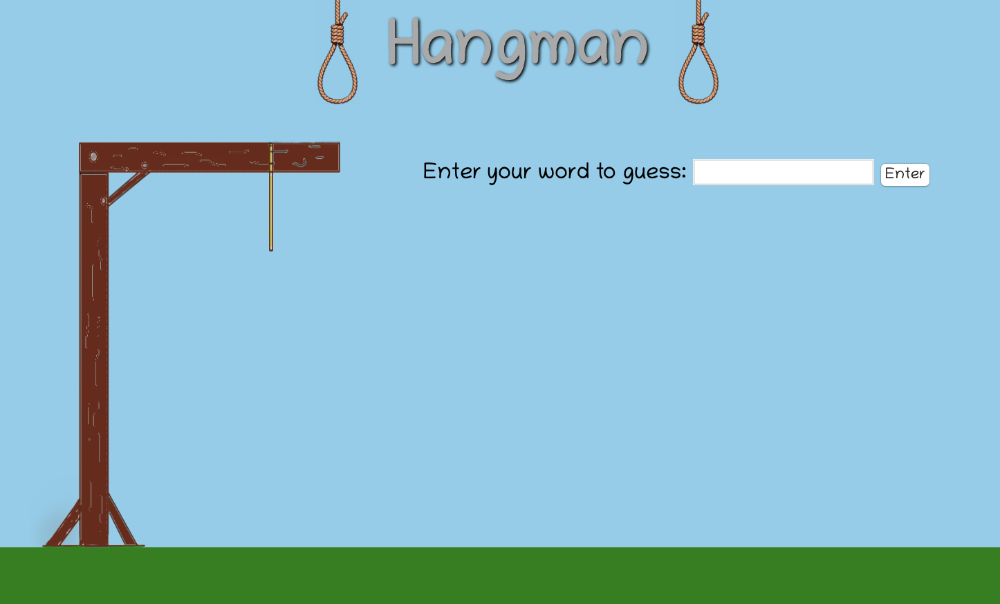
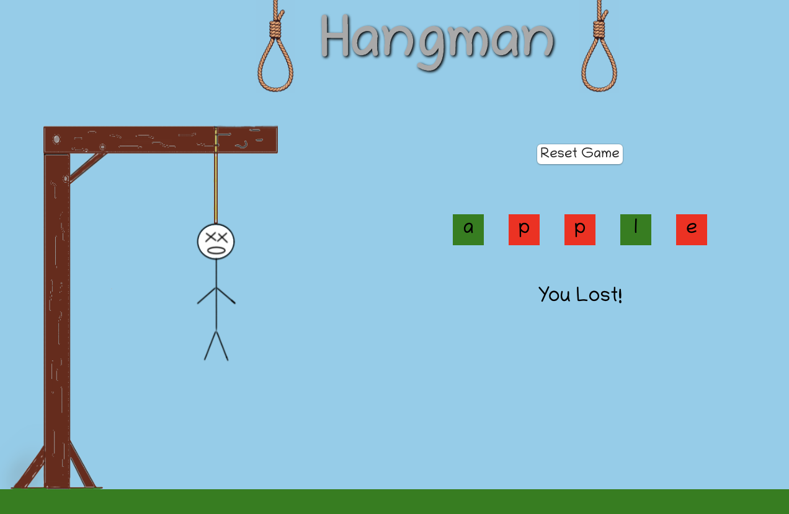

# Hangman
[Settings](https://github.com/walterporzel/hangman-game/settings)

## Description

Hangman is a game played between two players, one person who chooses a word and another who takes turns guessing letters. If the guesser chooses 6 letters that are not in the word before completing the word, they lose the game. If they correctly guess all letters in the word, they win the game.

The code contained in this repository composes an online version of the classic game.

## Gameplay

Upon opening the game, the user is prompted to enter in a word for the second player to guess:

After a word is submitted, the entry screen is hidden and a series of blank spaces representing each letter appear. The second player takes turns guessing letters. If they guess correctly, the corresponding blank space fills in and is colored green. If they guess incorrectly, one feature of the hanging man is added. If they complete the whole word, a winning message is displayed. If they incorrectly guess 6 times a losing message is displayed along with the complete word they were trying to guess.

## Technologies Used

This webpage is structured in HTMl and styled in CSS. Interaction with the webage is acheived through Javascript DOM manipulation.

The webpage is responsively designed to display aesthetically on both mobile phones and larger desktops.

## Technical Description

When the game is launched there are a series of short animations that make use of the keyframes features of CSS, modifying the transform and opacity styles of 3 elements. Once the opening page is fully displayed, the user is prompted to choose to either enter a word or have a word randomly generated.

When the chosen input button is clicked the input box is hidden and replaced with a reset button via DOM manipulation. A virtual keyboard is also displayed on the screen, with event listeners attached to each individual key. Event listeners are additionally tied to each letter key on the keyboard to chose between using the physical keyboard or the virtual keyboard. When the end-user guesses a letter via either input method two separate functions are run, one to check the input letter against the word and another to check the overall game status. 

Each letter is pushed into a 'letterGuess' array when entered, which is compared to a 'letters' array (containing each letter in the solution word) each time the check function runs. If the guessed letter matches any of the solution letters the display properties are changed so the letters are visible in a green box. Comparing the two arrays in a nested loop structure accounts for solution words with multiple instances of the same letter.

Within the status function, the 'letterGuess' array is iterated over, checking to see if each element is included in the 'letters' array. If there is no match, then a 'misses' counter is incremented by one. Once the overall misses are calculated the variable is run through a series of conditional logic statements, which modify the display property of the different gallows images. If the total misses reach 6 a losing message is displayed and the background property of the missed letters is set to red.

To check if the game has been won the background property of each div in the word-guess function is checked to see if it is green. If the background of every element is green, then the winning message is displayed.
